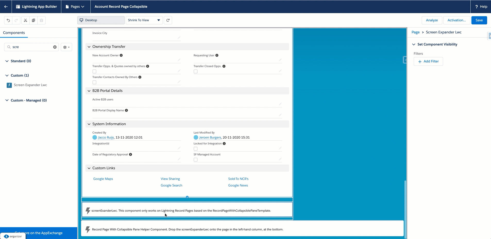

# lightning-page-expander

- Create a new Lightning Page based on the 2-column `RecordPageWithCollapsiblePaneTemplate`
- Drop the `screenExpanderLwc` onto the Lightning Page. It should be dropped in the first column at the bottom of the column.

You're ready to go.

# How does it work?
- The `screenExpanderLwc` communicates with the `RecordPageWithCollapsiblePaneTemplHelper` Aura component through a Lightning Message Channel `@salesforce/messageChannel/screenExpanderChannel__c`. 
- Because any Aura template component (implementing `lightning:recordHomeTemplate`) cannot listen to a LMS (it throws a GACK;         https://trailblazer.salesforce.com/issues_view?id=a1p4V000000oRm3QAE), instead the `RecordPageWithCollapsiblePaneTemplHelper` receives the expand/collapse message from the `screenExpanderLwc` and in turn propagates via traditional Aura event `RecordPageCollapsiblePaneEvent` to the `RecordPageWithCollapsiblePaneTemplate` component. 
- The `RecordPageWithCollapsiblePaneTemplate` expands/collapses the right-hand (1/3) column. 

Beware; this is a bare-bones approach. Any customization to the font, color and such should be done in the `screenExpanderLwc`. Positioning of the expander is done based of fixed-position.

